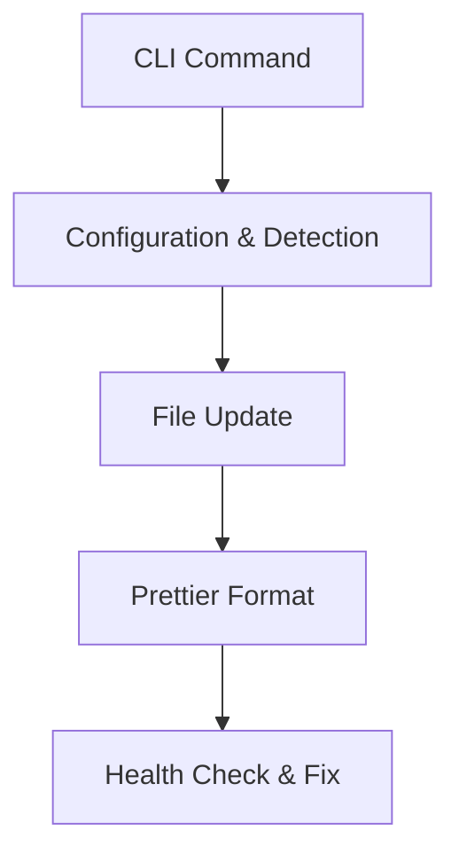

# Advanced Usage

Groot offers several advanced features to help you tailor its behavior to your project needs.

## Dynamic Imports & Brand-Specific Paths

Groot supports dynamic loading of translation files. You can use custom resolvers to load brand-specific translations:

```ts
const { setLocale } = useTranslation();

await setLocale(
  'en',
  `@/brands/${process.env.REACT_APP_BRAND}/translations/en`
);
```

## RTL/LTR Support

Groot natively supports RTL and LTR languages. The locale configuration includes a `direction` property which you can use to set the text direction:

```tsx
import { useTranslation } from '@snapp/groot';

function Layout({ children }) {
  const { getCurrentLocale } = useTranslation();
  const { direction } = getCurrentLocale();

  return <div dir={direction}>{children}</div>;
}
```

## Automatic Health Checks

Use the `groot doctor` command to run a health check on your translation files. This command compares keys used in your code with those in your translation files and can automatically fix issues if needed.

## Custom CLI Commands

Groot includes CLI commands to add new locales and translation keys without manually editing files:

- **`groot add-locale`** – Add a new locale.
- **`groot add-translation`** – Add a new translation key.

These commands also run Prettier after making changes to keep your code clean.

## Mermaid Diagram: Advanced Flow



This diagram shows the flow of an advanced CLI command (e.g., `add-locale`) from user input to file updates and auto-formatting.
