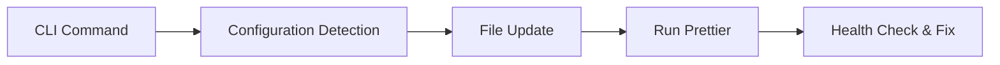

# CLI Commands

Groot provides a suite of CLI commands to help manage your translations.

## `groot init`

Initializes your Groot project by generating the required folder structure and sample translation files. It prompts you for:

- Whether you already have translation files.
- Which languages to support.
- The location for your translation files.

## `groot doctor`

Performs a health check on your translations. It scans your source code for translation key usage and compares it with your translation files.  
Features:

- Reports unused keys.
- Reports missing translations.
- Optionally fixes issues automatically with the `--fix` flag.
- Can output a detailed report with `--report-path`.

Example:

```bash
npx groot doctor --fix --report-path ./reports/groot-report.md
```

## `groot add-locale`

Adds a new locale to your project by prompting for:

- Language name
- Locale code
- Text direction (LTR/RTL)

It automatically updates your `src/groot/index.ts` (or `index.js`) file by injecting the new locale into the configuration.

Example:

```bash
npx groot add-locale
```

## `groot add-translation`

Adds a new translation key to all translation files. It prompts for:

- The translation key name.
- Optionally, a common default translation value.

This command automatically updates each translation file (excluding type definitions) without overwriting them.

Example:

```bash
npx groot add-translation
```

### Mermaid Diagram: Advanced Flow



This diagram shows the flow of an advanced CLI command from user input to file updates and auto-formatting.

_Note: All commands come with fun Groot‑themed log messages to keep the mood light!_
