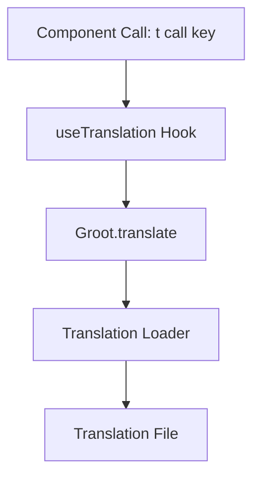

# How Groot Works

Groot leverages dynamic imports and a modular architecture to provide a robust translation system.

## Architecture Overview

At its core, Groot uses a **GrootBuilder** to create an instance of the **Groot Class**. The workflow is as follows:

1. **Initialization:**

   - The `init` method of the Groot class is called.
   - It loads the current locale from storage (or uses a default).
   - It dynamically loads the translation files using the provided loader function.

2. **Translation Usage:**

   - The `useTranslation` hook provides a `t` function.
   - This function calls `groot.translate`, which fetches the translation string and performs variable interpolation.

3. **CLI Tools:**
   - Groot includes CLI commands like `groot doctor`, `groot add-locale`, and `groot add-translation` for maintaining your translation files.

## Mermaid Diagram: Translation Flow



This flowchart illustrates how a component’s call to `t('key')` eventually retrieves the correct translation from the translation file.

## Under the Hood

- **Dynamic Imports:**
  Groot uses dynamic imports to load only the translation files that are needed, keeping the bundle size small.

- **Storage & Locale Detection:**
  The current locale is stored (e.g., in localStorage) so that users see their preferred language on subsequent visits.

- **Type Safety:**
  For TypeScript projects, Groot generates types automatically from your translation files to ensure that your calls to `t()` are type-safe.

```

```
