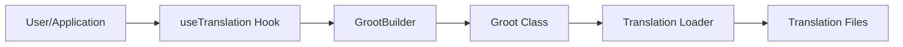

# Introduction to Groot

> "I am Groot!" – The universal translation guardian that protects your application’s translations!

Groot is a powerful, tree-shakeable translation system designed to work seamlessly with React, Next.js, and vanilla JavaScript/TypeScript applications. It provides:

- Automatic configuration detection
- Zero‑config setup for new projects
- Dynamic loading of translation files
- Full TypeScript support with auto-generated types
- Built‑in CLI commands to manage locales and translation keys

In this documentation, you'll learn how Groot works, how to set it up, and how to use its advanced features.

---

## Overview

Groot is built around two main pillars:

1. **Automatic Configuration & Dynamic Loading:**  
   Groot automatically detects your translation files, loads them dynamically, and even generates type definitions for TypeScript projects.

2. **CLI Tools for Maintenance:**  
   Use commands like `groot doctor`, `groot add-locale`, and `groot add-translation` to ensure your translations are complete and up‑to‑date.

Enjoy exploring Groot—your very own translation guardian!

---

## Mermaid Diagram: Architecture Overview

This diagram shows how user calls in your application eventually route through the `useTranslation` hook to the GrootBuilder, then to the core Groot class which dynamically loads translation files.
